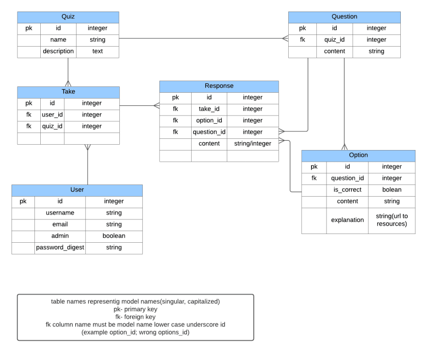

# quiz-api

this is a simple quiz api.

## Database Design



## Project Structure

```
.
├── manage.py
├── core
│   ├── __init__.py
│   ├── asgi.py
│   ├── settings.py
│   ├── urls.py
│   └── wsgi.py
├── quiz
│   ├── __init__.py
│   ├── admin.py
│   ├── apps.py
│   ├── migrations
│   │   ├── 0001_initial.py
│   models.py
│   urls.py
│   views.py
|   admin.py
```

## API Endpoints

### Quiz

- `GET /api/quiz/` - List all quiz
- `POST /api/quiz/` - Create a new quiz
- `GET /api/quiz/<int:pk>/` - Retrieve a quiz
- `PUT /api/quiz/<int:pk>/` - Update a quiz
- `DELETE /api/quiz/<int:pk>/` - Delete a quiz

### Question

- `GET /api/question/` - List all question
- `POST /api/question/` - Create a new question
- `GET /api/question/<int:pk>/` - Retrieve a question
- `PUT /api/question/<int:pk>/` - Update a question
- `DELETE /api/question/<int:pk>/` - Delete a question

### Answer

- `GET /api/answer/` - List all answer
- `POST /api/answer/` - Create a new answer
- `GET /api/answer/<int:pk>/` - Retrieve a answer
- `PUT /api/answer/<int:pk>/` - Update a answer
- `DELETE /api/answer/<int:pk>/` - Delete a answer
